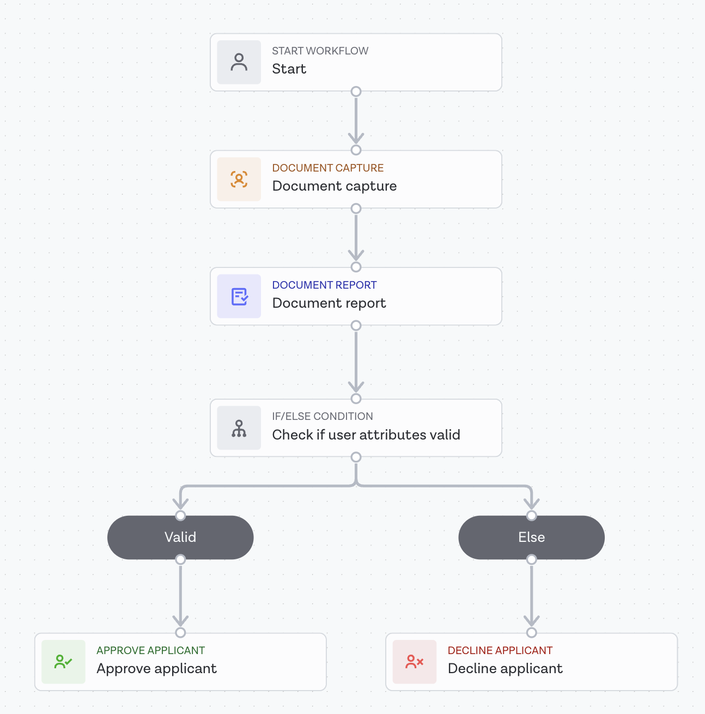

## Creating a Workflow in Onfido Studio

Onfido Studio allows you to create dynamic end-user verification journeys using the Workflow Builder, 
a no-code, drag-and-drop interface available directly through the Onfido Dashboard. 
This interface lets you build, maintain, and update workflows without requiring developer involvement.

When using the WSO2 Onfido connector for identity verification, you need to create a workflow that, 
at a minimum, includes document data capture. Optionally, you can also integrate face capture into the workflow.

### Important Notes:

- **Workflow Inputs:** You must configure the workflow to accept the necessary user attributes for verification. 
Ensure that the required attributes are supported for verification.
- **Workflow Outputs:** It's mandatory to configure the workflow outputs to include data comparison results, 
which will be sent in the webhook response. Make sure that Comparison Checks are enabled and the workflow output 
is configured appropriately. For more details, refer to 
(Onfido's Comparison Checks documentation)[https://documentation.onfido.com/api/latest/#data_comparison].

### Follow these steps to create a simple workflow for user attribute verification:

#### Step 1 : Access Workflow Builder:

- Log in to the Onfido Dashboard. 
- Navigate to the **Workflows** section.

#### Step 2 : Create a New Workflow:

- Click on the **New Workflow** button.
- Click on **New Version** to be redirected to the Workflow Builder page.

#### Step 3 : Design the Workflow:

- Use the drag-and-drop interface to create the workflow. Ensure it includes the necessary steps for document and, 
optionally, face capture, as shown in the reference image.

  

#### Step 4 : Configure Workflow Inputs:

- Set up the workflow to accept the user attributes you wish to verify. For details on configuring inputs, refer to the [Onfido Studio Input Data documentation](https://documentation.onfido.com/getting-started/onfido-studio-product/#workflow-input-data).

#### Step 5 : Configure Workflow Outputs:

- Set up the workflow to return data comparison results by following these steps:
    1. Go to the workflow output configuration section.
    2. Under the **Configure** tab, add a new property named `data_comparison` and set its format to `Other`.
      
    3. Navigate to the **Sources** tab, and under both `APPROVE APPLICANT` and `DECLINE APPLICANT`, select 
   `Document report - Breakdown - Data comparison - Breakdown`.
      
    4. Click the **Done** button.
- For more information, refer to the [Onfido Studio Output Data documentation](https://documentation.onfido.com/getting-started/onfido-studio-product/#workflow-output-data).

#### Step 6 : Set Workflow Conditions:

- Define the conditions that will determine if an applicant is approved. Since this workflow focuses on user attribute 
verification, ensure that at least the condition **Document report - Breakdown - Data comparison - Result** is set to 
**clear**. You can add additional conditions based on your requirements, but keep in mind that the WSO2 Identity Server 
will only mark the attribute verification as successful if the workflow returns an approved status for the applicant.

#### Step 7 : Save the Workflow:

- Review the workflow and click **Save** to finalize the setup.

By following these steps, you will have successfully created a minimalistic workflow in Onfido Studio for user
attribute verification.
