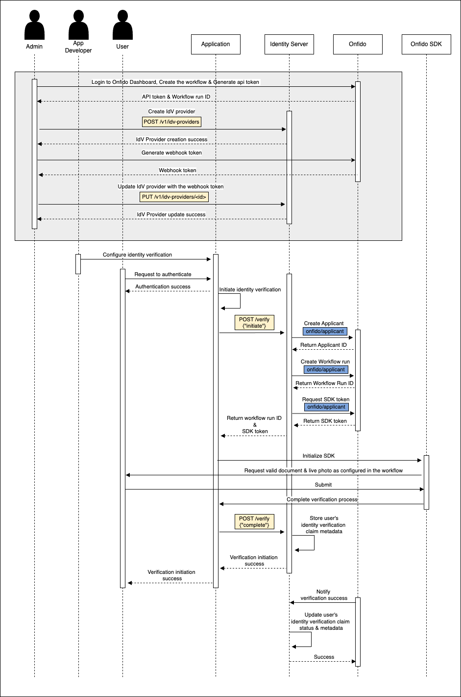

### Technical Workflow - Onfido Identity Verification

The Onfido Identity Verification Connector integrates seamlessly with WSO2 Identity Server to enable secure and efficient
user identity verification. The following outlines the technical workflow that supports this integration, as illustrated
in the accompanying sequence diagram:

1. **Admin Configuration in Onfido Dashboard**:
   - The administrator logs into the Onfido Dashboard to create a verification workflow and generate the necessary API 
   credentials, such as the API token and Webhook token. These credentials are essential for configuring the Onfido 
   Identity Verification Provider in WSO2 Identity Server.

2. **Configuring Onfido in the Identity Server Console**:
   - The administrator configures the Onfido Identity Verification Provider within the WSO2 Identity Server console using
   the API credentials obtained from the Onfido Dashboard. This setup enables the Identity Server to communicate with 
   Onfido for verification purposes

3. **Setting Up the Application for Identity Verification**:
   - The application developer configures the application to integrate with the Onfido Identity Verification Provider. 
   This setup allows the application to use Onfido for verifying user identities as part of the authentication process.

4. **User Authentication and Verification Initiation**:
   - When a user attempts to authenticate through the application, they first need to successfully complete the 
   authentication process. If the user's claims are not yet verified, the application triggers the identity verification
   process. This is done by making an API call to WSO2 Identity Server, which initiates the verification process.
   - WSO2 Identity Server then creates an applicant in Onfido, starts the verification workflow, and generates 
   an SDK token. This token is used to launch the Onfido SDK within the application, allowing the user to begin the 
   verification process.
   

5. **Launching and Completing the Verification Process**:
   - The Onfido SDK, launched using the SDK token and Workflow Run ID, guides the user through the verification process. 
   The user is prompted to submit the required documents and complete any additional verification steps, such as 
   capturing a live photo.
   - Once the user completes these steps, the application sends a request to WSO2 Identity Server to finalize the 
   verification process. This ensures that the user's verification status is updated accordingly in the Identity Server.

6. **Webhook Configuration and Status Update**:
   - Onfido sends status updates to WSO2 Identity Server via webhooks, providing real-time notifications of any changes 
   in the verification status. WSO2 Identity Server uses these updates to automatically update the user's identity 
   verification claim metadata.
   - Accurate webhook configuration is essential to ensure that the user's verification status is correctly reflected 
   in WSO2 Identity Server.

The sequence diagram below visually represents this technical workflow, illustrating how each step in the process is 
carried out to ensure secure and reliable user identity verification.

This diagram outlines the integration between Onfido's identity verification process and WSO2 Identity Server, 
highlighting the secure and efficient verification experience provided to end-users.